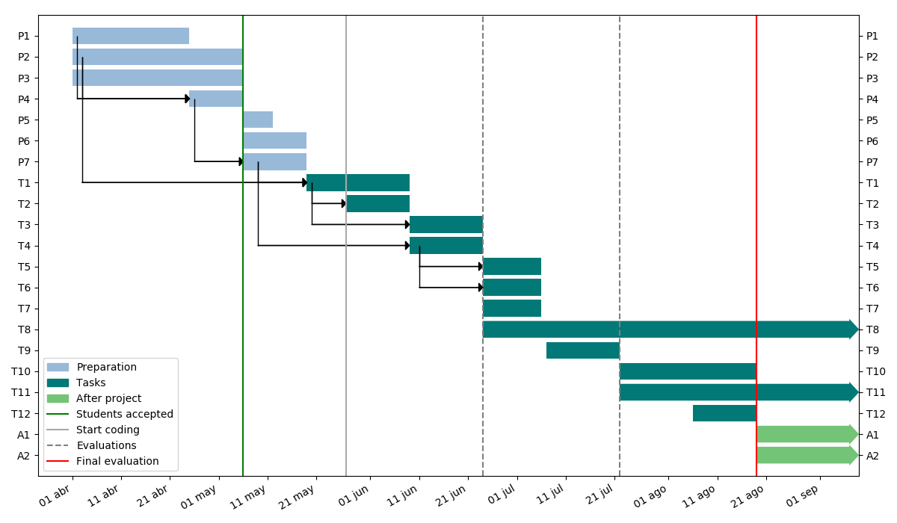

#  Information criteria and convergence assessment tools for ArviZ

## Abstract

ArviZ is a Python package for exploratory analysis of Bayesian models, from diagnostics to visualization. 
It is designed as a backend-agnostic tool with the goal to reach the widest user base and thus contribute 
to extend best practices among Bayesian inference practitioners.

Two key problems in this field are model comparison and convergence analysis. Model comparison is not 
trivial because of the different structures and number of parameters of each model. Fortunately, there 
are some information criteria (i.e. leave-one-out (LOO) cross-validation) that can be used for this task. Even 
though convergence is proven for infinite iterations, it is not the case for finite MCMC runs, which can 
be arbitrarily bad. Convergence assessment must take into account both intra- and inter-chain correlations.

ArviZ implements many of these algorithms for diagnostic and comparison, at least at a preliminary level, 
but it still lacks plots and tools to ease and improve its interpretation. This project seeks to design 
and implement these tools. Moreover, it will pay special attention to testing and documentation with examples 
not only of the new functionalities, but also of the already implemented ones.

## Technical Details

This project will analyze the diagnostic and statistical functions in ArviZ to assess the stage they are in. 
In addition, there are some plots related to the interpretation of these functions (i.e. `plot_khat` or 
`plot_autocorr`) which will also be analyzed (and created if any relevant function is missing, which for example, may 
be the case of the LOO probability integral transformation (PIT) plot requested in [#80](https://github.com/arviz-devs/arviz/issues/80)). 
Each of these functions should (in decreasing priority):

1. Be implemented coherently with ArviZ API. More specifically, for statistical functions, take as input an InferenceData object or xarray and 
return structured and easily interpreted data.
1. Have a docstring detailing its use, inputs and outputs
1. Have tests covering the most frequent use cases. This includes checking different parameter combination and warning messages, if appliable
1. Include examples on its usage, notes on its implementation (if appliable) and references in docstring
1. Be thoroughly explained in [arviz_resources](https://github.com/arviz-devs/arviz_resources)

Therefore, this project will require intensive usage of many external libraries, such as `xarray`, `sphinx`, 
`pytest` and in less extent `matplotlib`. GitHub issues will also play a key role in discussing ArviZ's API
(i.e. [#501](https://github.com/arviz-devs/arviz/issues/501),  or [#415](https://github.com/arviz-devs/arviz/issues/415)).
It will also be essential to have a deep understanding of the mathematics behind the algorithms in order to write relevant 
examples and documentation.

## Schedule of Deliverables

The project will start with a design phase to decide with the core developers and the community which functions (if any) 
should be added to ArviZ and to agree on a unique API. In addition, while working on these two deliverables, I will 
familiarize myself with the algorithms and libraries used in the project.

The second phase will build on top of the previous deliverables, guaranteeing that all selected functions fulfill points 
1-3 (as explained above). I will start with information criteria (IC) related functions and afterwards work with MCMC diagnostics.

Eventually, point 4 will be tackled for as many functions as possible. However, point 5 will be adressed following the 
draft of its table of contents one subject at a time in order to ensure the quality and thoroughness of the resources written.

### **Community Bonding Period** (before May 19th)

* P1: Familiarize with the needed libraries: ArviZ, pytest, xarray, sphinx 
* P2: Familiarize and understand all the algorithms involved
  - Read references in ArviZ docs and in issues requesting new stats or diagnostic features
  - Read ArviZ's or similar libraries implementation
* P3: Contribute to ArviZ tests, preferably but not exclusively to project related functionalities.   
* P4: Create a proposal for functions to add to ArviZ and for the unique API
* P5: Decide the methodology to include the work in the [final evaluation](https://google.github.io/gsocguides/student/evaluations#final-evaluations-and-work-product-submission)
* P6: Write examples of existing IC functions
* P7: Participate in the discussion of API and functions design and decide on one of the alternatives

Expected results:

* Reading literature and implementation of the algorithms that will be used is essential to understand them
and to asses which ones should be present in ArviZ.
* Reading ArviZ implementation of the already present functions will also be a way to check their documentation.
* Working with tests will provide me with hands on experience with the code, with the extra advantage of making error 
detection easier in the next steps of the project.
* One (or several) issue with the proposal for the functions to add to ArviZ and for the API (i.e. `plot_khat` and 
`plot_autocorr` both need to execute a stats/diagnostics function before plotting, `plot_khat` makes the used execute 
the function and its input is not InfereceData whereas `plot_autocorr`'s input is InferenceData and calls the autocorr 
function itself). 

### **Phase 1** (May 20th  - August 19th)

* T1: Implement and document IC functions
* T2: Write their tests
* T3: Write IC examples
* T4: Guarantee documentation and tests of MCMC diagnostics (and implementation if appliable)
* T5: Guarantee tests for MCMC diagnostics
* T6: Guarantee examples  for MCMC diagnostics
* T7: Check behaviour in a wide range of real cases (extra examples and possible issues from ArviZ prereleases users)
* T8: Correct bugs
* T9: Profile memory and cpu usage to identify possible bottlenecks
* T10: Write a draft of one related section in ArviZ-resources (optional)
* T11: Finish or continue working on any pending task
* T12: Write GSoC final evaluation

### **After GSoC** 

* A1: Finish the still pending goals if any.
* A2: Contribute solving bugs on the created functions and answering issues about their usage.

## Why me?

My name is Oriol Abril. I graduated from Engineering Physics at Polytechnical University of Catalonia in 2017. 
I am currently graduating in High Enegry Physics, Astrophysics and Cosmology at the Autonomous University of Barcelona. 
Since my first research experience in 2013, I have made use of multiple programming languages, including Python, Matlab 
or Fortran. Many of my projects have involved Bayesian inference, especially with 
[emcee](https://emcee.readthedocs.io/en/latest/). Upon discovering ArviZ nearly a year ago and realizing 
its power with regard to my inference results -in storing, plotting, or comparing them, among other 
aspects- I began to extensively use it.

### Development Experience

I have worked in many projects related with scientific programming, not only during my undergraduate and 
graduate studies, but also in extracurricular activities such as collaborations with the [Molecular Spectroscopy 
Group](https://www.isis.stfc.ac.uk/Pages/Molecular-Spectroscopy.aspx) at the ISIS neutron source and with the High 
Energy Physics Institute ([IFAE](http://www.ifae.es/eng/)). In addition, I have participated actively in 
[StackOverflow](https://stackoverflow.com/users/2504700/xg-plt-py), mainly in questions related to matplotlib, 
numpy, pandas and vectorization. 
I have used ArviZ for my Master's Thesis and, as a result, I am familiar with most of its functions and API.

Moreover, I have already contributed to ArviZ:

* Documentation
  - [#436](https://github.com/arviz-devs/arviz/pull/436): Add emcee and pyro cookbook examples [MERGED]
  - [#616](https://github.com/arviz-devs/arviz/pull/616): Update Docker instructions [MERGED]
  - [#630](https://github.com/arviz-devs/arviz/pull/630): 3 documentation issue fixes [OPEN]
  - [#638](https://github.com/arviz-devs/arviz/pull/638): Add `from_emcee` inline examples [OPEN]
* Testing
  - [#624](https://github.com/arviz-devs/arviz/pull/624): Helper method for tests [MERGED]
* IO:
  - [#426](https://github.com/arviz-devs/arviz/pull/426): emcee version 3 compatibility [MERGED]
  - [#450](https://github.com/arviz-devs/arviz/pull/450): Update `io_pyro` to pyro 0.3 release [MERGED]
  - [#550](https://github.com/arviz-devs/arviz/pull/550): Emcee reader support [MERGED]
* Plotting bugs:
  - [#615](https://github.com/arviz-devs/arviz/pull/615): `plot_pair` return value [MERGED]
  - [#619](https://github.com/arviz-devs/arviz/pull/619): Remove `plot_density` tight_layout [MERGED]
  - [#637](https://github.com/arviz-devs/arviz/pull/637): Fix `plot_pair` issue and add extra options to `plot_kde` [OPEN]
* Other
  - [#620](https://github.com/arviz-devs/arviz/pull/620): Add logging arviz wide [OPEN]

### Other Experiences

In addition to my academic background and programming experience, I have also performed extensive courses in 
Probability, Statistics, Algebra, Numerical Computation and related subjects during my undergraduate and graduate studies.

## Why ArviZ?

I have always been really interested in modelling and inference, specifically in Bayesian modelling. In my research projects,
I have come to realize that in many cases modelling is treated as a limited set of models and techniques _universally_ 
appliable, either disregarding or not even knowing the limitations of the models and algorithms used. I believe 
that ArviZ is capable of extending and explaining Bayesian modelling techiques to a really wide community. It will approach
many algorithms and best practices to people with limited programming habilities, together with a thorough documentation, 
which will cover its uses and limitations.

## References

